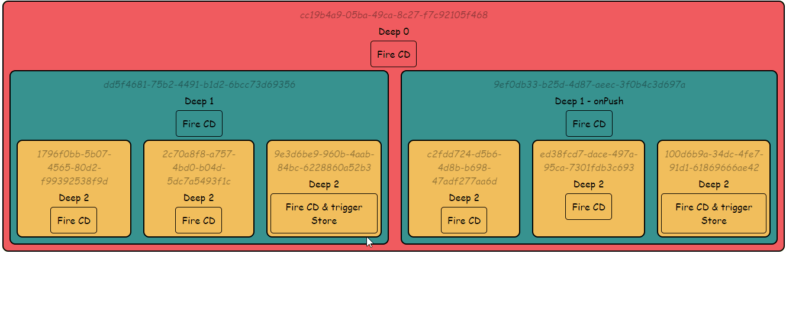
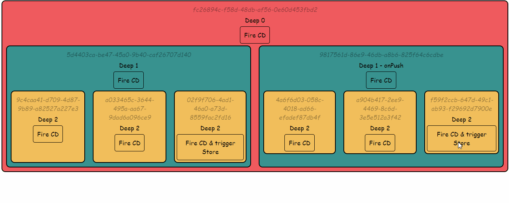
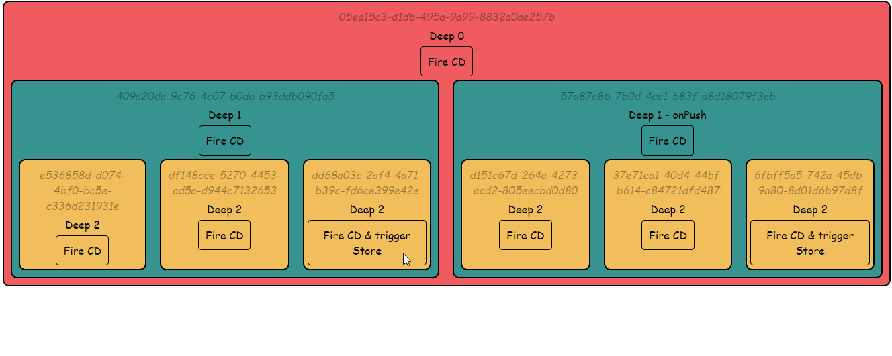

# Change detection

Ce projet a pour but de tester les stratégies mises en place par **[Angular][angularLink]** pour garantir la détection de changement.

Le projet se compose de plusieurs composants inclus les un dans les autres simulant un arbre de composants que l'on trouverait dans un projet.

La profondeur de ceux-ci est représentée par couleur. Chaque composant génère également son propre UUID pour être identifié plus facilement.

Le process de détection de changement peut être provoqué par le clic sur n'importe quel composant. **Si la détection de changement et déclenchée sur un composant, celui-ci laissera un log en console.**

Différents scénarios sont testables via différentes branches :
  - **[Master][masterBranchLink]** représente le comportement par défaut. On y observe qu'**un événement  provoque le processus de détection de changements dans l'ensemble de l'arbre**, quelle que soit la profondeur du composant où l'événement a été déclenché.
  - **[OnPush/default][onPushDefaultBranchLink]** comporte une branche de l'arbre sous stratégie "onPush". **Le process de détection de changement n'est pas déclenché pour cette partie lors d'événement déclenchés en dehors de cette branche**. Cependant, tout événement ayant lieu sur cette branche déclenche le process pour l'ensemble de l'arbre.
  - **[OnPush/subscriptions][onPushSubBranchLink]** a été tirée de la branche **[OnPush/default][onPushDefaultBranchLink]** [(PR pour comparaison)](https://github.com/hugoMencoboni/angularChangeDetectionTests/pull/3/files) avec l'ajout d'actions notifiant un **[sujet][subjectLink]** pouvant affecter des composants horizontalement, quelle que soit leurs branches. On y observe **que si l'action est déclenchée sur une autre branche celle affectée par la stratégie OnPush, la branche OnPush n'est pas notifiée (le process de détection de changement n'y est pas déclanché)**.
  
  

  Il l'est bien entendu si l'action provient d'un composant de la branche sous stratégie OnPush.
  
  

  - **[OnPush/subscriptionsManagement][onPushSubMngBranchLink]** a été tirée de la branche **[OnPush/subscriptions][onPushSubBranchLink]** avec les modifications nécessaire pour que les composants de la branche OnPush soient notifiés [(PR pour comparaison)](https://github.com/hugoMencoboni/angularChangeDetectionTests/pull/4/files). **Cela s'effectue via l'ajout de [MarkForCheck][MarkForCheckLink] à la souscription**.
  
  

  - **[OnPush/asyncPipe][onPushPipeBranchLink]** a aussi été tirée de la branche **[OnPush/subscriptions][onPushSubBranchLink]**. Cette foi-ci, les souscriptions ont été gérées via le **[pipe Async][asyncPipeLink]** [(PR pour comparaison)](https://github.com/hugoMencoboni/angularChangeDetectionTests/pull/5/files). Le process de détection de changement est alors automatiquement géré, sans qu'il y ait besoin d'ajouter **[MarkForCheck][MarkForCheckLink]** aux souscriptions. **L'appel à [MarkForCheck][MarkForCheckLink] est, en effet, directement intégré [à la directive][asyncPipeInternalLink].**

***Note:** le projet a été forcé en mode "production" pour être plus proche de la stratégie appliquée. Angular procède en effet à une double vérification en mode "dev" pour s'assurer que la vue ne changement pas après un premier process de détection de changements.*

## Conclusions et interprétations

Choisir la stratégie de détection de changements d'un composant est un moyen concret d'améliorer les performances de celui-ci. Ce choix nous permet de limiter les processus de détection de changements, processus performant, mais qui peut être coûteux lorsqu'une application comporte beaucoup de composants.

**Cependant, la stratégie OnPush n'est pas anodine.** 

Elle nécessite de gérer avec une plus grande attention les inputs de nos composants (souvent par l'ajout de la librairie **[ImmutableJS][immutableJSLink]**).

Mais elle nécessite également une gestion de toute autre ressource externe de nos composants dont la stratégie est en OnPush **et de tout composant enfant d'un composant OnPush.** Cette gestion peut se faire facilement via l'utilisation de **[MarkForCheck][MarkForCheckLink]**.

Il est nécessaire d'avoir une réflexion au cours d'un projet sur la nécessité de passer sur une telle stratégie. 

Doit-on en amont géré tout composant comme pouvant être enfant d'un composant à stratégie OnPush et intégrer l'utilisation de **[MarkForCheck][MarkForCheckLink]** à la consommation de ressources externes ?

Doit-on favoriser l'utilisation du pipe async pour son automatisation de cette gestion du processus de détection de changement ?

Pour une meilleure compréhension de ces processus, vous pouvez vous reporter à **[ce très bon article de Michael Hoffmann.][CHArticleLink]**

[angularLink]: https://angular.io/
[subjectLink]: https://rxjs-dev.firebaseapp.com/guide/subject
[MarkForCheckLink]: https://angular.io/api/core/ChangeDetectorRef#markforcheck
[asyncPipeLink]: https://angular.io/api/common/AsyncPipe
[asyncPipeInternalLink]: https://github.com/angular/angular/blob/9.1.x/packages/common/src/pipes/async_pipe.ts#L154
[immutableJSLink]: https://immutable-js.github.io/immutable-js/
[CHArticleLink]: https://www.mokkapps.de/blog/the-last-guide-for-angular-change-detection-you-will-ever-need/

[masterBranchLink]: https://github.com/hugoMencoboni/angularChangeDetectionTests/tree/master
[onPushDefaultBranchLink]: https://github.com/hugoMencoboni/angularChangeDetectionTests/tree/onPush/default
[onPushSubBranchLink]: https://github.com/hugoMencoboni/angularChangeDetectionTests/tree/onPush/subscriptions
[onPushSubMngBranchLink]: https://github.com/hugoMencoboni/angularChangeDetectionTests/tree/onPush/subscriptionsManagement
[onPushPipeBranchLink]: https://github.com/hugoMencoboni/angularChangeDetectionTests/tree/onPush/asyncPipe